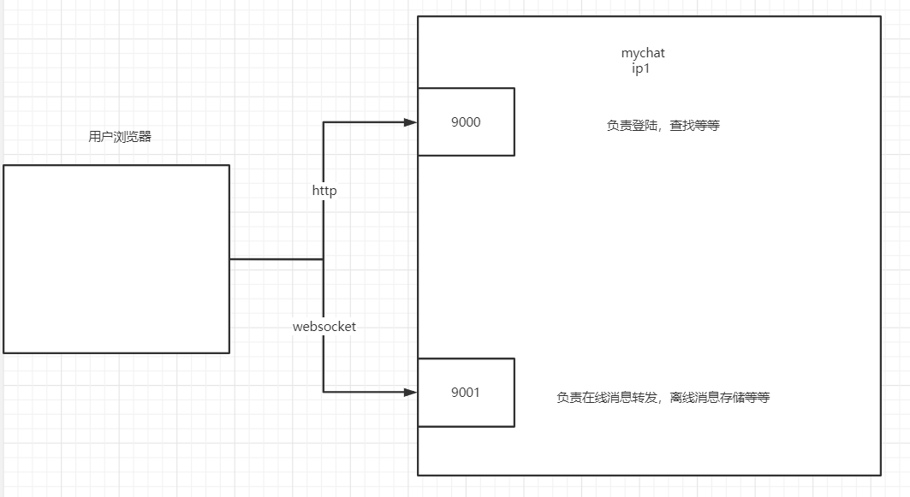

# mychat
mychat原是数据库课程设计，我们小组的作品mychat0，它模仿的是网页版的微信。原定要实现单聊，群聊，朋友圈的，
但实际上只实现了单聊和群聊。mychat经mychat0（springboot单体应用）改造而来，将 较为繁忙的websocket通信部分 
与 较为轻闲的http通信部分 分离，这样可以只布置一个http服务，而布置多个websocket服务。

## mychat0 简单结构图


## mychat结构图


## trivial1.2
trivial是我编写的一个rpc框架，版本1.2可在spring环境中使用，但需要一个Bean。
```java
    //使得trivial可以从当前ioc容器中获取到bean，在当前接受rpc，进行方法反射调用时用到
    @Bean
    public TrivialSpringUtil trivialSpringUtil(){
        return new TrivialSpringUtil();
    }
```
trivial 1.2 github地址：https://github.com/AllenDuke/trivial/tree/1.2

## 使用
运行HttpApplication, WebsocketApplication中的main方法。注意配置文件，如application.properties，rpc.yml

## 演示 （样式有点问题）


